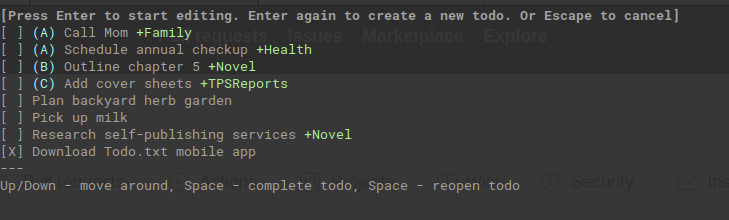

# Bubbledo

WIP [todo.txt](http://todotxt.org/) client that uses [bubbletea](https://github.com/charmbracelet/bubbletea) and [tsx](https://github.com/trashhalo/tsx)

# See Demo

1. Clone repo
2. In that folder run `go run .`

## Todo

- Does not actually save changes :)
- Due dates and completed dates
- Delete todos
- Cant draw more todos than screen can hold
- Charm integration!!!